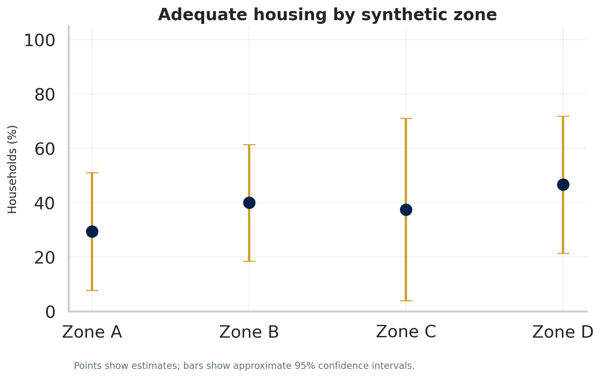
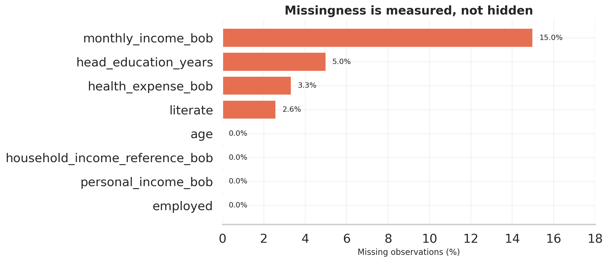
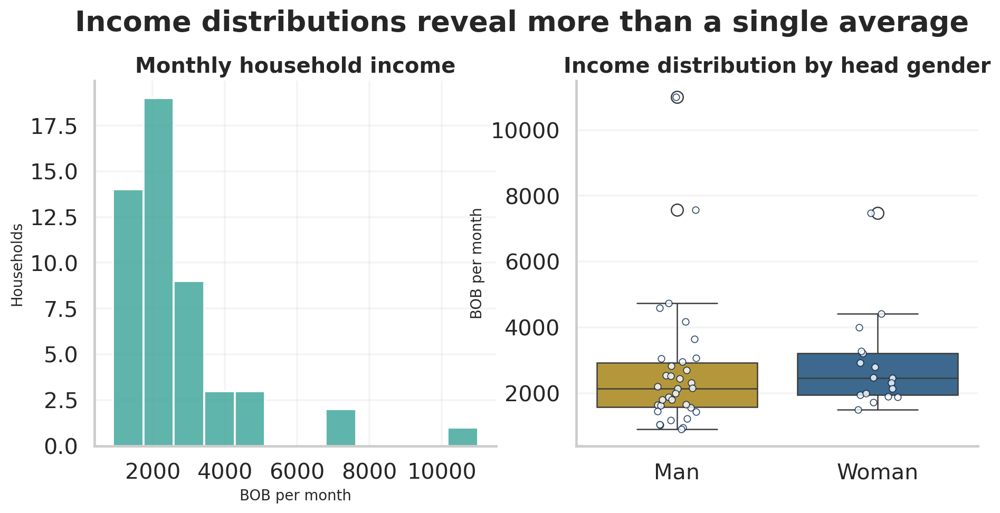
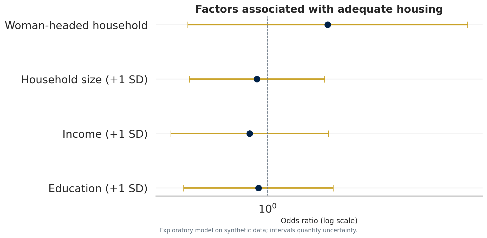

# Socioeconomic and Housing Conditions in Rural Bolivia

[](#reproduce-the-project)
[](data/README.md)
[](pyproject.toml)
[](PRIVACY.md)
[](https://github.com/MonicaCT/rural-bolivia-housing-analytics/actions/workflows/ci.yml)
[](https://monicact.github.io/rural-bolivia-housing-analytics/)

> A privacy-first, reproducible household-survey analysis combining uncertainty quantification,
> statistical modelling, data validation and responsible research communication.

**[Explore the live analytical report](https://monicact.github.io/rural-bolivia-housing-analytics/)**



## Why this project exists

The original academic archive mixed identifiable survey microdata with a static Word report. This
project separates private research records from public communication. It uses **fully
synthetic data** to implement and evaluate the analytical workflow without exposing real respondents.

## Research questions

1. Which socioeconomic factors are associated with adequate housing?
2. Where do gaps in literacy and employment appear across gender groups?
3. How do income, service access and crowding jointly relate to vulnerability?
4. How sensitive are conclusions to missingness and a small sample?

## Analytical approach

- Data contracts that reject direct identifiers and invalid ranges.
- Weighted descriptive estimates and bootstrap confidence intervals.
- Explicit missing-data audit before modelling.
- Composite housing and vulnerability indicators with documented definitions.
- Exploratory logistic regression with odds ratios and confidence intervals.
- Disaggregated gender indicators and disclosure-aware geographic aggregation.
- Ten publication-quality visualisations and a static web report.

For the logistic model,

$$
\log\left(\frac{p_i}{1-p_i}\right)=
\beta_0+\beta_1\mathrm{Education}_i+\beta_2\log(\mathrm{Income}_i+1)
+\beta_3\mathrm{HouseholdSize}_i+\beta_4\mathrm{WomanHead}_i.
$$

This is an **associational** model. The repository makes no causal claim.

## Selected outputs

| Data quality | Distribution | Modelling |
|---|---|---|
|  |  |  |

- [Interactive analytical report](docs/index.html)
- [STROBE-aligned research paper](docs/research-paper.html)
- [Technical report source](reports/technical-report.qmd)
- [Executive summary](reports/executive-summary.md)
- [Reporting checklist](reports/STROBE-checklist.md)
- [Model results](reports/model_results.csv)
- [Data dictionary](data/data_dictionary.csv)

## Repository structure

```text
data/          Synthetic public data, dictionary and provenance
docs/          GitHub Pages site and publication figures
notebooks/     Guided exploratory analysis
reports/       Technical and executive outputs
sql/           Reusable analytical data model
src/           Generation, validation, analysis and publication pipeline
tests/         Privacy, integrity and reproducibility tests
.github/       Continuous integration and Pages deployment
```

## Reproduce the project

```bash
python -m venv .venv
source .venv/bin/activate       # Windows: .venv\Scripts\activate
pip install -e ".[dev]"
python -m src.build_project
pytest
```

The generator uses a fixed seed. A clean run recreates the data, metrics, model tables, figures and
web page. Production research should pin dependencies with `uv.lock` and keep raw data in approved,
access-controlled storage.

## Key limitations

- Public records are synthetic and cannot estimate conditions in Coroico or Bolivia.
- Sixty households are insufficient for complex machine learning or strong subgroup claims.
- Synthetic weights and analytically defined indices are not substitutes for a documented sampling design or a
  validated measurement instrument.
- Multiple imputation and survey-design variance should be added when authorised source data and
  design variables are available.

## Responsible use

Read [PRIVACY.md](PRIVACY.md) before adapting this workflow. The analysis never loads the original
identifiable files. Code is MIT licensed; synthetic data are released under CC0.

## Resumen en español

Este repositorio presenta un análisis reproducible de encuestas usando datos completamente
sintéticos. Prioriza privacidad, calidad, incertidumbre y comunicación científica. Ningún resultado
debe interpretarse como una estimación real para Coroico o Bolivia.
