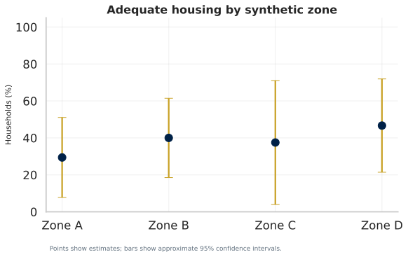
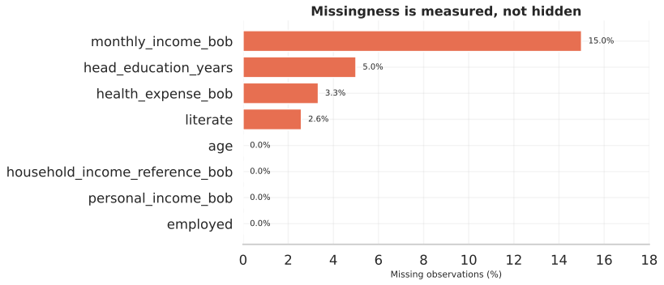
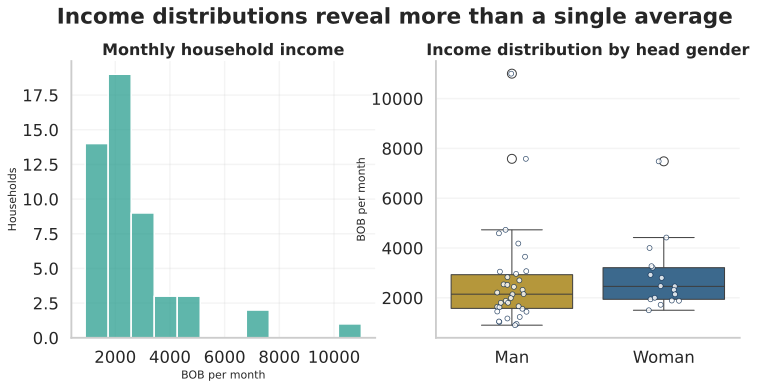
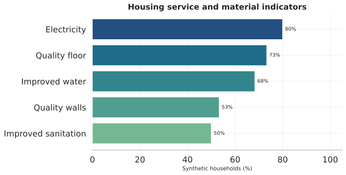
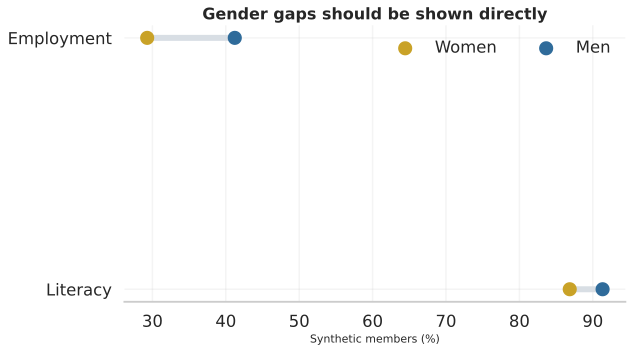
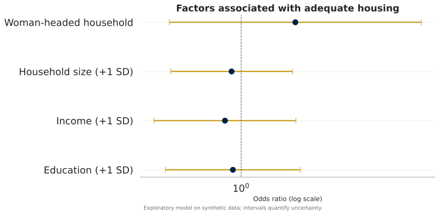

# Socioeconomic and Housing Conditions in Rural Bolivia

Privacy-first, reproducible household-survey analytics using fully synthetic public data, statistical modelling, uncertainty reporting and responsible research communication.


<p align="center">
  
</p>

<p align="center">
  <a href="https://monicact.github.io/rural-bolivia-housing-analytics/"></a>
  <a href="https://monicact.github.io/rural-bolivia-housing-analytics/research-paper.html"></a>
  <a href="https://monicact.github.io/rural-bolivia-housing-analytics/#figures"></a>
  <a href="https://monicact.github.io/rural-bolivia-housing-analytics/#tables"></a>
  <a href="https://monicact.github.io/rural-bolivia-housing-analytics/#methodology"></a>
  <a href="https://github.com/MonicaCT/rural-bolivia-housing-analytics"></a>
  <a href="https://monicact.github.io/MonicaCT/"></a>
</p>

## Research Position

This repository is a public, privacy-preserving version of a household-survey analysis workflow. It separates private research records from public communication by using fully synthetic data to demonstrate validation, uncertainty reporting, modelling and publication without exposing real respondents.

Public outputs are methodological and illustrative. They must not be interpreted as estimates for Coroico, rural Bolivia or any real population.

## Research Questions

1. Which socioeconomic factors are associated with adequate housing?
2. Where do gaps in literacy and employment appear across gender groups?
3. How do income, service access and crowding jointly relate to vulnerability?
4. How sensitive are conclusions to missingness and a small sample?

## Why This Matters

Survey repositories can easily mix analytical value with privacy risk. This project demonstrates a safer public pattern: validate data contracts, publish synthetic public data, disclose uncertainty and missingness, protect small groups, and keep causal interpretation proportional to the evidence.

## Key Findings From The Synthetic Public Workflow

- The public repository contains 60 synthetic households and 271 synthetic household members.
- The weighted adequate-housing estimate in the synthetic workflow is 37.9%, with a bootstrap 95% interval of 26.7%-51.7%.
- Median synthetic monthly household income is BOB 2210.
- Missingness is reported before modelling; income missingness is 15.0% in the public synthetic workflow.
- The exploratory logistic regression is associational and makes no causal claim.
- Every public figure and metric is based on synthetic records and is unsuitable for inference about real communities.

## Portfolio Classification

Primary lab:

- **Open Science Lab** - privacy-first reproducibility, synthetic public data, transparent validation and responsible dissemination.

Secondary labs:

- **Applied Economics Lab** - housing, poverty, services, vulnerability and rural development indicators.
- **Development Analytics Lab** - household-level analytical workflow with uncertainty and missingness reporting.
- **Research Methods Lab** - bootstrap intervals, exploratory regression, data contracts and STROBE-aligned reporting.
- **Data Science Lab** - Python, SQL, notebooks, tests and automated build workflow.
- **Business Intelligence Lab** - public analytical report and figure-based communication layer.

## Main Figures

| Missingness audit | Income distribution |
|---|---|
|  |  |

| Housing adequacy | Service access |
|---|---|
|  |  |

| Gender outcomes | Model coefficients |
|---|---|
|  |  |

## Data Coverage

Public data are synthetic and non-identifiable.

- 60 synthetic households;
- 271 synthetic household members;
- 37.9% weighted adequate-housing estimate in the synthetic workflow;
- 26.7%-51.7% bootstrap 95% interval for adequate housing;
- BOB 2210 median synthetic monthly household income;
- 15.0% missingness in synthetic household income;
- synthetic public data only, with original identifiable records excluded from the repository.

Data documentation:

- [Data documentation](data/README.md)
- [Data dictionary](data/data_dictionary.csv)
- [Privacy and responsible use](PRIVACY.md)

## Analytical Approach

The workflow includes:

- data contracts that reject direct identifiers and invalid ranges;
- weighted descriptive estimates and bootstrap confidence intervals;
- explicit missing-data audit before modelling;
- composite housing and vulnerability indicators with documented definitions;
- exploratory logistic regression with odds ratios and confidence intervals;
- disaggregated gender indicators with disclosure-aware aggregation;
- ten publication-quality visualisations and a static public report.

For the logistic model:

```text
logit(p_i) = beta_0 + beta_1 Education_i + beta_2 log(Income_i + 1)
             + beta_3 HouseholdSize_i + beta_4 WomanHead_i
```

This is an associational model. The repository makes no causal claim.

## Research Outputs

- [Live analytical report](https://monicact.github.io/rural-bolivia-housing-analytics/)
- [STROBE-aligned research paper](https://monicact.github.io/rural-bolivia-housing-analytics/research-paper.html)
- [Technical report source](reports/technical-report.qmd)
- [Executive summary](reports/executive-summary.md)
- [Reporting checklist](reports/STROBE-checklist.md)
- [Model results](reports/model_results.csv)
- [Key metrics](reports/key_metrics.json)

## Repository Structure

```text
data/          synthetic public data, dictionary and provenance
docs/          GitHub Pages site and publication figures
notebooks/     guided exploratory analysis
reports/       technical, executive and research-paper outputs
sql/           reusable analytical data model
src/           generation, validation, analysis and publication pipeline
tests/         privacy, integrity and reproducibility tests
.github/       continuous integration and Pages deployment
```

## Reproducibility

```bash
python -m venv .venv
source .venv/bin/activate       # Windows: .venv\Scripts\activate
pip install -e ".[dev]"
python -m src.build_project
pytest
```

The generator uses a fixed seed. A clean run recreates the synthetic data, metrics, model tables, figures and web page. This README harmonization did not rerun the pipeline, recalculate models or regenerate outputs.

## Responsible Use

Read [PRIVACY.md](PRIVACY.md) before adapting this workflow. The public analysis never loads the original identifiable files. Code is MIT licensed; synthetic data are released under CC0.

## Limitations

- Public records are synthetic and cannot estimate conditions in Coroico or Bolivia.
- Sixty households are insufficient for complex machine learning or strong subgroup claims.
- Synthetic weights and analytically defined indices are not substitutes for a documented sampling design or a validated measurement instrument.
- Multiple imputation and survey-design variance should be added only when authorised source data and design variables are available.

## Citation

Citation metadata are available in [CITATION.cff](CITATION.cff).

## Author

**Monica Cueto Tapia**<br>
GitHub: [MonicaCT](https://github.com/MonicaCT)

## Portfolio Navigation

- [MonicaCT GitHub profile](https://github.com/MonicaCT)
- [Economic Complexity and Structural Transformation in Latin America](https://github.com/MonicaCT/economic-complexity-structural-transformation-lac)
- [Inclusive Credit Risk Analytics - Bolivia](https://github.com/MonicaCT/InclusiveCreditRiskAnalytics-Bolivia)
- [Poverty, Informality and Social Protection in Latin America](https://github.com/MonicaCT/poverty-informality-social-protection-lac)
- [Financial Development, Stability and Growth in Latin America](https://github.com/MonicaCT/latin-america-financial-development-lab)
- [Structural Vulnerability in Latin America and the Caribbean](https://github.com/MonicaCT/structural-vulnerability-lac-research)

## License

This project is released under the [MIT License](LICENSE).