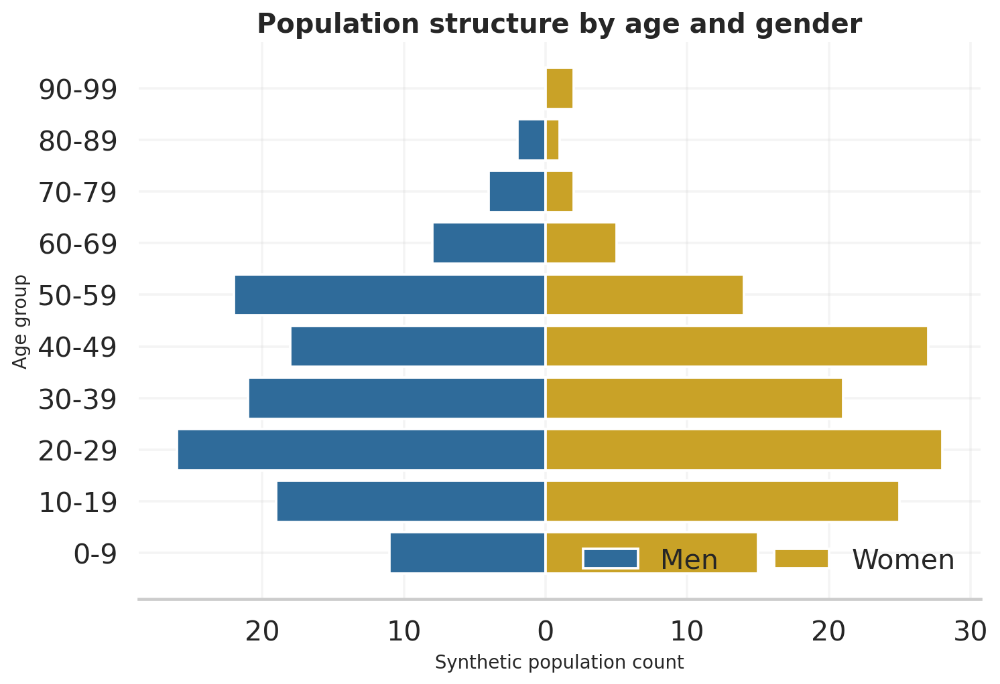
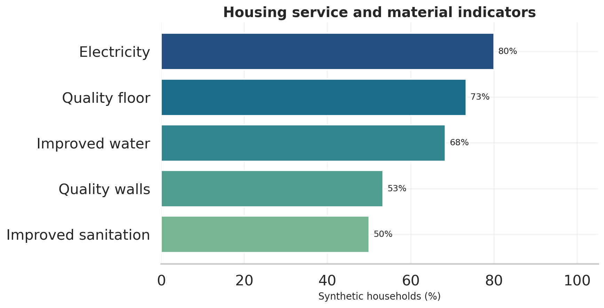
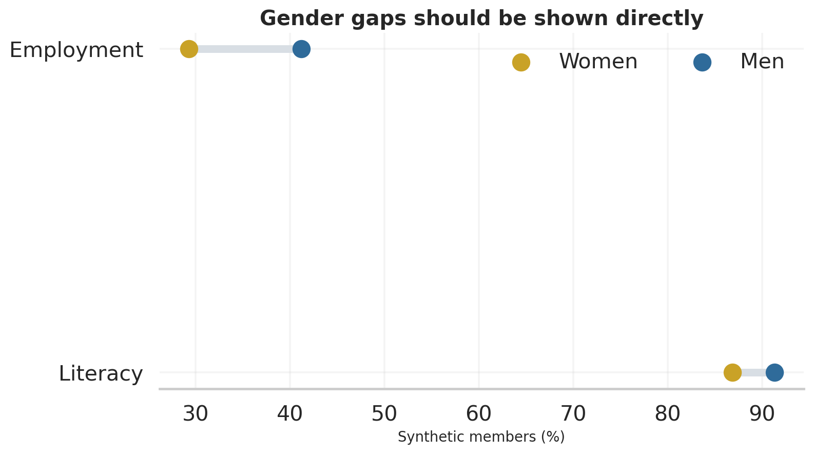

> **Data status:** all observations used in this public report are synthetic.

## Abstract

This report specifies and evaluates a privacy-preserving workflow for a small household survey. It combines data
contracts, weighted descriptive statistics, uncertainty quantification, missing-data diagnostics,
composite measurement and exploratory regression. The synthetic results are methodological examples,
not estimates for Coroico or Bolivia.

## Research design

The synthetic cross-sectional dataset contains 60 households and 271 household members. The unit of analysis is
declared separately for every estimand to avoid mixing household and person denominators. A real study
must additionally document sampling frame, field dates, selection probabilities, non-response and
post-stratification.

## Estimands

For weights $w_i$ and outcome $y_i$, the weighted mean is

$$
\bar y_w = \frac{\sum_{i=1}^{n}w_i y_i}{\sum_{i=1}^{n}w_i}.
$$

Bootstrap intervals use the empirical 2.5th and 97.5th percentiles across 2,000 household resamples:

$$
CI_{0.95}(\hat\theta)=
\left[Q_{0.025}(\hat\theta^*),Q_{0.975}(\hat\theta^*)\right].
$$

## Measurement

The housing score is the share of six binary components: electricity, improved water, improved
sanitation, quality walls, quality floor and no severe crowding. Adequate housing is defined as a score
of at least two thirds. This transparent rule is preferable to an undocumented index, but it still
requires substantive validation before policy use.

The analytically defined vulnerability index is

$$
V_i=100\left[1-\left(0.42H_i+0.28\frac{E_i}{16}
+0.30\min\left(\frac{Y_i}{6000},1\right)\right)\right]+\epsilon_i.
$$

Its coefficients are illustrative rather than empirically validated.

## Data quality and missingness

Denominators are reported for each result. For authorised source data, the next stage would compare
complete and incomplete cases, specify plausible missingness mechanisms, and pool estimates across
multiple imputations rather than silently applying complete-case analysis.

## Descriptive analysis

## Gender-disaggregated outcomes

Differences are descriptive. Responsible interpretation requires confidence intervals, sample-size
disclosure and attention to gender measurement beyond the binary variable used in this study.

## Exploratory model

For household $i$, the probability of adequate housing is modelled as

$$
\operatorname{logit}(p_i)=\beta_0+\beta_1E_i+\beta_2\log(Y_i+1)
+\beta_3S_i+\beta_4G_i.
$$

The model is deliberately parsimonious because the sample contains only 60 households. Coefficients
describe conditional associations and cannot identify causal effects.

## Robustness and future work

- Re-estimate using the actual stratification, clusters and sampling weights.
- Use multiple imputation and compare against complete-case estimates.
- Test alternative housing thresholds and index weights.
- Pre-register primary outcomes before confirmatory analysis.
- Use a directed acyclic graph before any causal interpretation.
- Validate codebooks, label mappings and denominators against field instruments.

## Ethics and limitations

The original microdata are excluded because combinations of personal and socioeconomic variables can
identify respondents. Public reproducibility is achieved with synthetic data, code, tests and aggregate
outputs rather than disclosure of confidential records.

